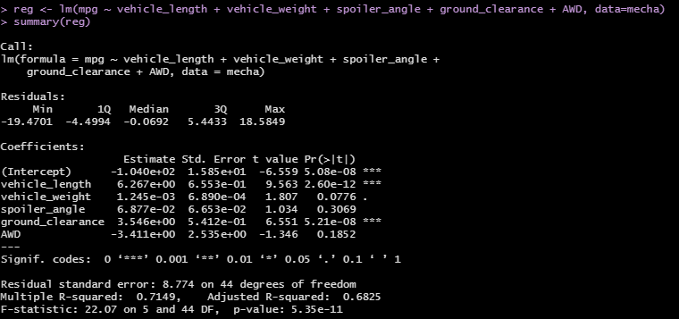
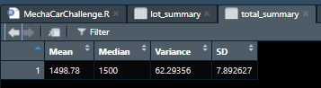
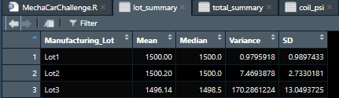
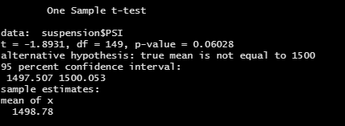
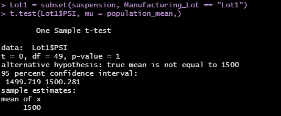
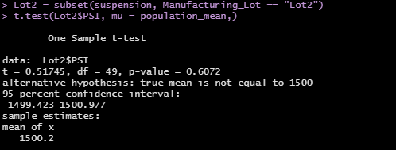
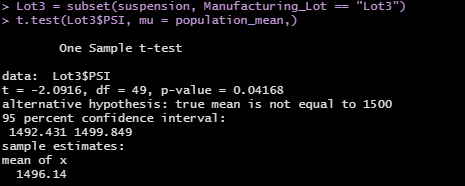

# MechaCar_Statistical_Analysis

## Linear Regression to Predict MPG
Based on a multiple linear regression analysis, the variables that provide a non-random amount of variance to the MPG values, which corresponds to individual variable p-values less than 0.05 are: 
* Vehicle Length (vehicle_length), individual variable p-value = 2.6E-12
* Ground Clearance (ground_clearance), individual variable p-value = 5.2E-08. 

The other variables in the dataset, Vehicle Weight (p-value = 0.08), Spoiler Angle (p-value = 0.31) and AWD (p-value = 0.19) provide random variance to the MPG based on the dataset.

The slope of the linear model is not considered to be zero. The estimated slope values, m, for the two variables of significance are 6.3 and 3.5 for Vehicle Length and Ground Clearance, respectively. This indicates that there is a non-zero slope of the linear model.

The linear model does not predict the MPG of MechaCar prototypes effectively. Although the multiple linear regression analysis has identified the two variables that provide non-random amount of variance to the MPG, the lack of signivant variables indicates the likelihood of overfitting; the linear model is likely to be able to predict future MPG outcomes accurately.

The RStudio console output from the multiple linear regression is provided in the image below.

## Summary Statistics on Suspension Coils
The suspension coil manufacturing lot dataset was analyzed to identify if any lots were outside of design specifications. The image below provides the mean, median, variance and standard deviation of the measure coil pressure in pounds per square inch (PS() for all manufacturing lots in the datatset.

Based on the summary statistics based on the manufacturing lot, Lot 3 does not meet the MechaCar design specifications. Lot 3's variance exceeds the speciicatioin of a variance less than or equal to 100 psi. The variance for Lot 3, as well as Lot 1 and Lot 2, is provided in the image below.

## T-Tests on Suspension Coils
### All Lots
The image below provides a summary of the t-test outcomes for the suspension coil pressure for all three manufacturing lots compared to the assumed population mean of 1500 psi. Based on the one sample t-test p-value of 0.06, there is no statistically significant difference in the means of the manufacturing lots compared to the population mean. 

### Lot 1
The image below provides a summary of the t-test outcomes for the suspension coil pressure for manufacturing lot 1 compared to the assumed population mean of 1500 psi. Based on the one sample t-test p-value of 1.0, there is no statistically significant difference in the means of manufacturing lot 1 compared to the population mean. 

### Lot 2
The image below provides a summary of the t-test outcomes for the suspension coil pressure for manufacturing lot 2 compared to the assumed population mean of 1500 psi. Based on the one sample t-test p-value of 0.61, there is no statistically significant difference in the means of  manufacturing lot 2 compared to the population mean. 

### Lot 3
The image below provides a summary of the t-test outcomes for the suspension coil pressure for manufacturing lot 3 compared to the assumed population mean of 1500 psi. Based on the one sample t-test p-value of 0.04, **there is a statistically significant difference in the means of manufacturing lot 3 compared to the population mean**. 

## Study Design: MechaCar vs Competition
### Metrics to Test
To position MechaCar for successful launch, the analytics team recommends the following metrics be investigated to identify any differentators of MechaCar from the competition:
* Base MSRP, options costs and incentives.
* City MPG, Highway MPG and combined MPG.
* Torque, horsepower and braking performance.
* NHTSA safety rating.

These metrics should be compared both in the target MechaCar vehicle class as well as all new model vehicles from the competition.

### The Null Hypothesis
The Null Hypothesis for the study is that there is no statistically significant difference between MechaCar's sample metrics and the competition popluation.

### Statistical Test
The analytics team recommends using t-tests to the the null hypothesis. The t-tests will compare MechaCar sample dataset to the various competiion population groups. This test is valid since the goal is to compare the MechaCar sample to populations. From the returning p-values, the tests will indicate statistically significant differences in the MechaCar metrics and those of the various competition populations.

### Data Requirements
The data required to run the statistical tests are:
* Database of metrics of competition for both similar class vehicles to MechaCar and the overall population for:
+ Base MSRP, options costs and incentives.
+ City MPG, Highway MPG and combined MPG.
+ Torque, horsepower and braking performance.
+ NHTSA safety rating. 

The same data are required for the MechaCar offering in order to complet the study.

